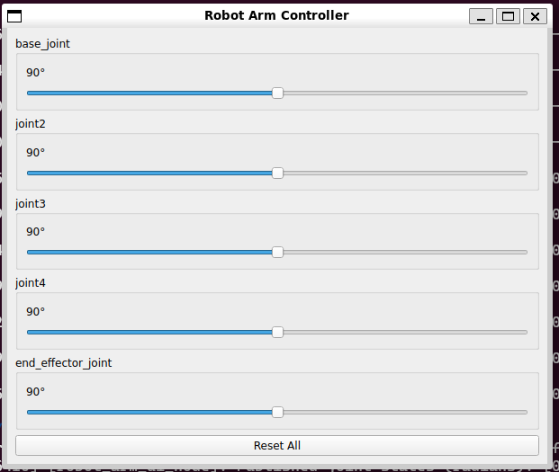
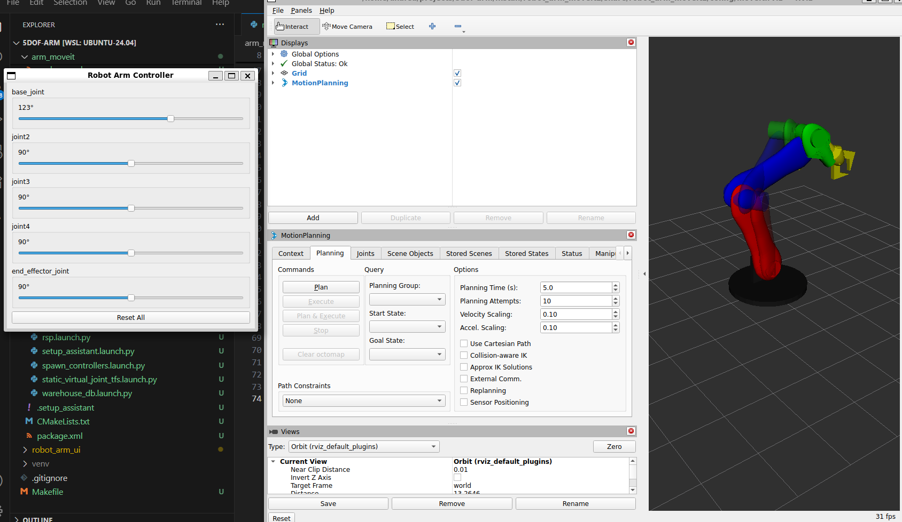
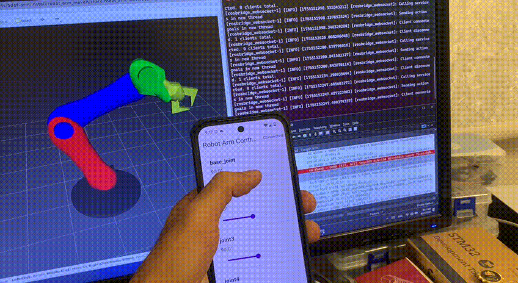
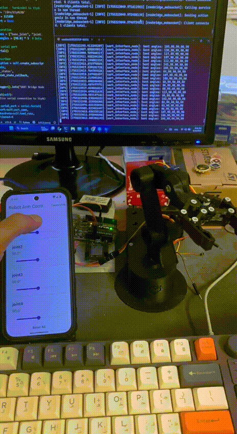

Set of ROS2 packages to Control and visualize a [5-DOF robotic arm](https://github.com/NafieAlhilaly/5-dof-arm-design) using ROS 2, RViz and MoveIt, as well as interface with microcontrollers.


# Packages Overview
### Robot Arm UI
The Robot Arm UI. This interface allows you to interact with the arm in a user-friendly way.



### Robot Arm Description
Contains necessary Robot Arm difnition files, such as URDF and SRDF, to describe the robot's physical structure and capabilities.

### Robot Arm Interface
This package provides the necessary interfaces to control the robotic arm, including communication with microcontrollers and other hardware components.

### Robot Arm MoveIt
This package integrates MoveIt with the robotic arm, allowing for advanced motion planning and control. It includes launch files for various MoveIt functionalities such as move group, RViz visualization, and setup assistant.


<br />
<br />
<br />

# Setup
> Tested on ROS2 **Kilted** ✅

make sure you have ROS2 **Kilted** and source the workspace before running the commands below.

### Building the Packages
Use Makefile to build the project:
```bash
make clean build
```

source the workspace:
```bash
source install/setup.bash
```

### Running packages
To run any of the packages, you can use the following command:
```bash
ros2 run <package_name> <executable_name>
```

### Using Flutter Client
You can also use the Flutter client to control the robotic arm. The client is available in the [Flutter-ROS2-Client Repo](https://github.com/NafieAlhilaly/Flutter-ROS2-Client).
To enable the client to communicate with the ROS2 workspace, you need to a bridge service such as [rosbridge](https://github.com/ros2/ros1_bridge) to enable communication between the Flutter client and the ROS2 workspace using WebSocket.

<br />
<br />
<br />

# Usage
### Launching the Robot Arm in the Simulation
To launch the robot arm in RViz with MoveIt, use the following command:
```bash
ros2 launch robot_arm_moveit demo.launch.py
```
in another terminal, you can launch the robot arm UI to control the arm:
```bash
ros2 run robot_arm_ui robot_arm_ui_node
```
or use [Flutter-ROS2-Client Repo](https://github.com/NafieAlhilaly/Flutter-ROS2-Client).

### Communication with Microcontroller
Make sure you are connecting the microcontroller to the correct serial port e.g. `/dev/ttyUSB0` or `/dev/ttyACM0`.
If you are using Windows Subsystem for Linux (WSL), you'll need a tool to bridge the serial port, such as [usbipd](https://github.com/dorssel/usbipd-win) check thier docs for more information.

The robot arm interface communicates with the microcontroller to control the servos using robot_arm_ui_node or [Flutter-ROS2-Client Repo](https://github.com/NafieAlhilaly/Flutter-ROS2-Client)..
run the node
```bash
ros2 run robot_arm_interface uart_interface_node

```

The microcontroller code in `robot_arm_interface/sketches/src.ino` listens for commands over serial and updates the servo angles accordingly.

Upload the code using Arduino IDE,
### Testing
Using the Robot Arm UI package to control the robot arm in the simulation:



<br />
<br />
<br />

Using Android Client App to control the robot arm in the simulation:


